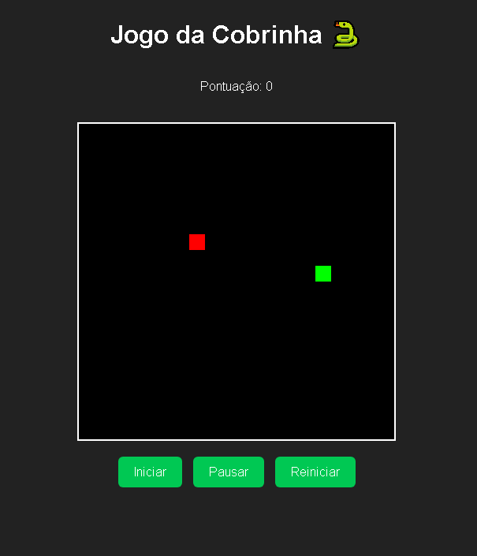

# 🐍 Jogo da Cobrinha (Snake Game)

Um simples jogo da cobrinha feito com **HTML, CSS e JavaScript puro**, totalmente funcional e comentado.
Inclui botões de **Iniciar**, **Pausar** e **Reiniciar** o jogo.

---

## 🎮 Demonstração

## 

## 🚀 Funcionalidades

- ✅ Movimento da cobrinha com as setas do teclado
- ✅ Geração aleatória de comida
- ✅ Pontuação em tempo real
- ✅ Fim de jogo ao colidir com parede ou com o próprio corpo
- ✅ Botões de controle:

  - **Iniciar:** Começa o jogo
  - **Pausar:** Interrompe o jogo
  - **Reiniciar:** Zera e reinicia a partida

---

## 🧱 Estrutura de Pastas

```
/snake-game
│
├── index.html      # Estrutura principal
├── style.css       # Estilos visuais
└── script.js       # Lógica do jogo
```

---

## 🧩 Como Executar

1. **Baixe ou clone o repositório:**

   ```bash
   git clone https://github.com/igortriveloni86/projeto_snake.git
   ```

2. **Abra o arquivo `index.html`** no seu navegador (basta dar dois cliques).

3. Divirta-se jogando! 🎉

---

## 🕹️ Controles

| Ação                | Tecla          |
| ------------------- | -------------- |
| Mover para cima     | ⬆️             |
| Mover para baixo    | ⬇️             |
| Mover para esquerda | ⬅️             |
| Mover para direita  | ➡️             |
| Pausar/Iniciar      | Botões na tela |

---

## 🧠 Lógica do Jogo

- A cobrinha é um **array de coordenadas (x, y)**.
- Cada quadro do jogo é redesenhado usando o **`canvas`**.
- O loop principal é controlado por **`setInterval()`**, com velocidade ajustável.
- Quando a cobrinha come a comida, um novo segmento é adicionado e a pontuação aumenta.
- Colidir com as bordas ou consigo mesma finaliza o jogo.

---

## 🧑‍💻 Tecnologias Utilizadas

- **HTML5 Canvas**
- **CSS3**
- **JavaScript (ES6)**

---

## 📄 Licença

Este projeto está sob a licença MIT — sinta-se livre para usar, modificar e distribuir.

---

Feito com ❤️ em JavaScript puro.
